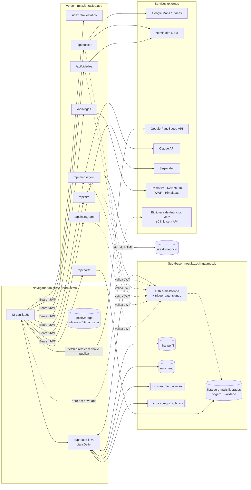
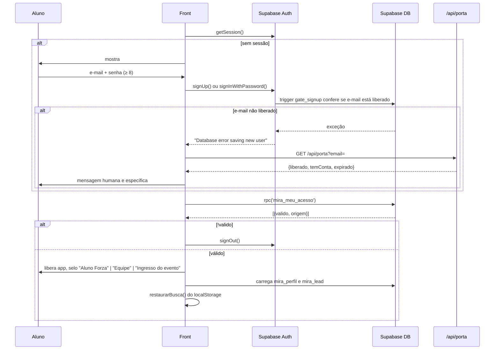
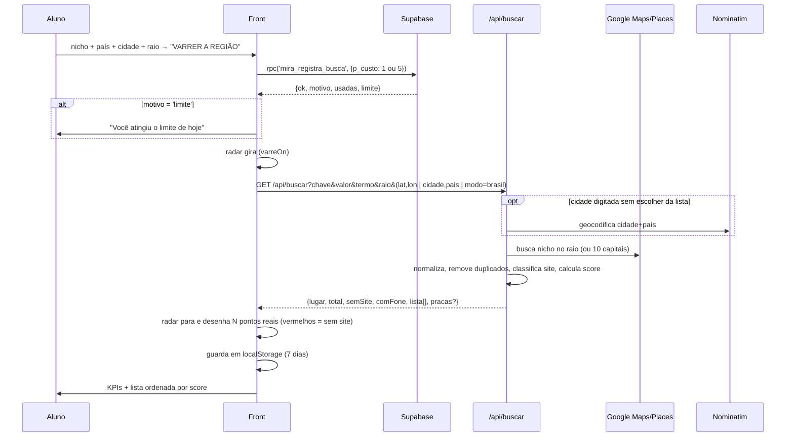
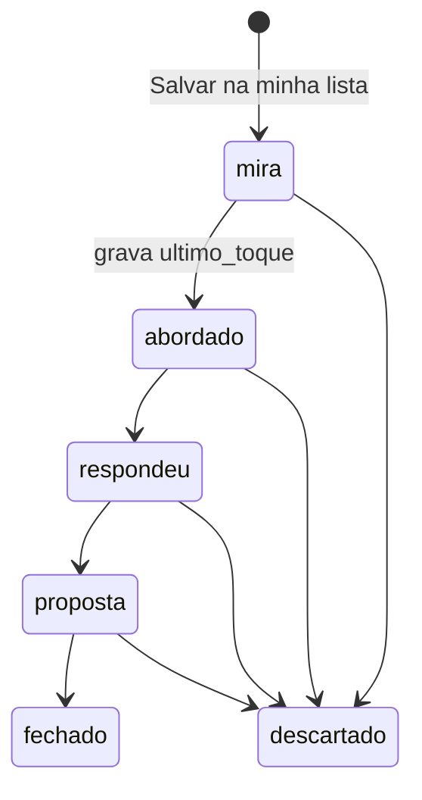

# MIRA — Arquitetura e funcionamento

> **"Encontre quem precisa de você antes de mandar mensagem."**
> Ferramenta de prospecção para designers / web designers (alunos da Mentoria Forza).
> Varre negócios locais do Google Maps, separa **quem não tem site** de **quem tem site ruim**, diagnostica o site, dá uma **nota de oportunidade**, escreve a **mensagem de abordagem** e guarda tudo num **mini-CRM**.

- **Produção:** https://mira.forzaclub.app (Vercel, região `gru1` — São Paulo)
- **Análise feita em:** 12/09/2026
- **Fonte:** o front-end completo (um único `index.html` de 172 KB, 2.925 linhas) foi baixado e lido por inteiro. O código do servidor (`/api/*`) **não é público**, então o comportamento dele foi reconstruído a partir de: (1) como o front chama cada rota e o que ele lê da resposta, (2) os comentários deixados no código, (3) respostas reais das rotas sem login.

Legenda de confiança usada no documento:
- ✅ **Confirmado** — está escrito no código do front ou foi observado na resposta real.
- 🟡 **Inferido** — dedução forte a partir de evidências, mas o código do servidor não foi visto.

---

## 1. Visão geral em uma frase por camada

| Camada | Tecnologia | O que faz |
|---|---|---|
| **Front-end** | 1 arquivo HTML + CSS + JS puro (vanilla, sem framework, sem build) | Toda a interface: login, busca, lista, diagnóstico, mensagens, funil, i18n, animações |
| **Hospedagem** | Vercel (arquivo estático + Serverless Functions em `/api/*`) | Serve o HTML e roda as rotas de API |
| **Auth + Banco** | Supabase (Auth por e-mail/senha + Postgres + RPC + RLS) | Contas, liberação de acesso por ingresso, créditos diários, perfil, lista de leads |
| **Dados de negócios** | Google (Maps/Places) via servidor 🟡 | Nome, endereço, telefone, site, nota, nº de avaliações, opiniões |
| **Geocodificação** | Nominatim (OpenStreetMap) via servidor ✅ (comentário no código) | Autocomplete de cidade e lat/lon |
| **Diagnóstico de site** | Leitura "crua" do HTML no servidor + Google PageSpeed Insights direto do navegador ✅ | Nota do site, lista de problemas, porte |
| **Mensagem com IA** | Claude (Anthropic) via servidor ✅ (comentário: "créditos do Claude") | Mensagem personalizada por negócio |
| **Perfis do Instagram** | Serper.dev (Google Search API) restrito a `instagram.com` ✅ (comentário: "saldo do Serper") | Achar infoprodutores/prestadores pelo Google |
| **Vagas** | Remotive, RemoteOK, WeWorkRemotely, Himalayas ✅ (resposta real) | Vagas remotas de design em dólar |

---

## 2. Diagrama de arquitetura



**Ponto-chave de desenho:** não existe backend "de verdade" com estado próprio. O estado mora no **Supabase** (acessado direto do navegador com a chave publicável + RLS) e as funções da Vercel são **proxies finos** que escondem as chaves pagas (Google, Claude, Serper) e fazem o trabalho pesado de juntar/limpar/pontuar dados.

---

## 3. Estrutura do front-end (`index.html`)

Arquivo único, sem bundler. Ordem interna:

| Linhas | Bloco |
|---|---|
| 1–11 | `<head>`: favicon SVG inline (mira vermelha), Google Fonts (**Inter Tight**, **Plus Jakarta Sans**, **JetBrains Mono**), `supabase-js@2` UMD via jsDelivr (`defer`) |
| 12–614 | CSS inteiro (design tokens, componentes, animações) |
| 617–618 | Tela de abertura (`#carga`) com canvas de partículas |
| 619–900 | `.wrap` — app: header, abas, 4 painéis |
| 901–922 | `#porta` — modal de login/cadastro |
| 924–964 | `#telaPerfil` — modal do perfil |
| 968–2923 | JavaScript inteiro |

### 3.1 Telas (abas)

A troca de aba é só classe no `<body>` (`t-insta`, `t-vagas`, `t-funil`; sem classe = prospecção). Nada de roteador.

| Aba | Painel | Função |
|---|---|---|
| **Quem vende na internet** | `.painel-insta` | (a) Anunciantes: gera link da Biblioteca de Anúncios da Meta, aluno cola a URL da landing page e o MIRA diagnostica; (b) Perfis de Instagram (só para contas liberadas) |
| **Quem está no mapa** *(padrão)* | `.painel-prosp` | O coração do app: varredura de negócios locais |
| **Quem está contratando** | `.painel-vagas` | Vagas remotas de design |
| **Minha lista** | `.painel-funil` | CRM/funil dos leads salvos |

### 3.2 Estado global (variáveis soltas no `window`)

```js
RESULTADOS = []      // lista de negócios da última varredura
CTX = {}             // { termo, nicho, cidade } — usado nas mensagens
FILTRO = 'todos'     // 'todos' | 'sem' | 'com' | 'quente' | 'fone'
VARIANTE = {}        // índice do template de mensagem por card
RAIO = 12000         // metros (5000 | 12000 | 20000 | 30000)
MODO_BUSCA = 'cidade'// 'perto' | 'cidade' | 'brasil'
CREDITOS = null      // { usadas, limite }
SESSAO = null        // sessão Supabase
U = {nome, faz, cidade, zap, foto}  // perfil do aluno
LEADS = []           // linhas de mira_lead
CIDADE_SEL = null    // cidade escolhida no autocomplete {rotulo, lat, lon}
```

---

## 4. Fluxo 1 — Acesso (login restrito a quem comprou ingresso)



Detalhes ✅:
- **Portão no banco, não na tela:** um trigger `gate_signup` no Postgres derruba o cadastro de e-mail que não está na lista de compradores. O front só **traduz** o erro genérico do Supabase usando `/api/porta`.
- **`/api/porta?email=`** (pública, sem login) responde `{liberado, temConta, expirado}` ou `{indefinido}`. Sem e-mail → `400 {"erro":"e-mail invalido"}`.
- **Três origens de acesso:** `forza` (aluno), `equipe`, ingresso do evento. Acesso tem **validade** (conferida a cada busca).
- **Recuperação de senha:** `resetPasswordForEmail` com `redirectTo` para o próprio app; o retorno chega com `#type=recovery` e o front abre a porta no modo `nova` (lê o hash **antes** do supabase-js limpá-lo).
- **Token sempre fresco:** a função `api()` chama `sb.auth.getSession()` antes de **toda** chamada e manda `Authorization: Bearer <access_token>` (corrigiu bug de token vencido após 1h).

---

## 5. Fluxo 2 — Varredura de negócios ("Quem está no mapa")

Este é o núcleo do produto.



### 5.1 Entradas da busca ✅

| Campo | Valores |
|---|---|
| **Onde buscar** | `perto` (Geolocation API do navegador) · `cidade` · `brasil` (10 maiores capitais, **custa 5 créditos**) |
| **Nicho** | 17 fixos + "Outro nicho, eu escrevo" (texto livre → `termo=`) |
| **País** | 18 países (`br us ca gb ie au nz pt es mx ar cl co de fr it nl ae`) |
| **Cidade** | Autocomplete via `/api/cidades` (debounce 400 ms, mín. 3 letras). Se escolhida da lista, manda `lat`/`lon` e o servidor **pula a geocodificação** |
| **Raio** | 5 · 12 · 20 · 30 km (em metros no parâmetro) |

Os nichos fixos carregam **tags do OpenStreetMap** no `value` (`chave|valor`), por exemplo:

| Rótulo | `value` | Rótulo | `value` |
|---|---|---|---|
| Dentista | `dentist\|amenity` | Imobiliária | `estate_agent\|office` |
| Nutricionista | `nutrition_counselling\|healthcare` | Academia | `fitness_centre\|leisure` |
| Estética e beleza | `beauty\|shop` | Salão e barbearia | `hairdresser\|shop` |
| Fisioterapia | `physiotherapist\|healthcare` | Restaurante | `restaurant\|amenity` |
| Psicologia | `psychotherapist\|healthcare` | Clínica médica | `clinic\|amenity` |
| Veterinária | `veterinary\|amenity` | Pet shop | `pet\|shop` |
| Advocacia | `lawyer\|office` | Concessionária | `car\|shop` |
| Contabilidade | `accountant\|office` | Oficina | `car_repair\|shop` |
| | | Hamburgueria | `fast_food\|amenity` |

> 🟡 **Interpretação:** o formato OSM indica que a primeira versão buscava no **Overpass/OpenStreetMap**. Hoje os resultados trazem **nota, nº de avaliações e opiniões**, dados que o OSM não tem — então o servidor consulta o **Google (Places/Maps)**, provavelmente convertendo a tag OSM num termo de busca e mantendo o Nominatim só para geocodificar.

### 5.2 Chamada ✅

```
GET /api/buscar
  ?chave=amenity&valor=dentist          // ou vazios + &termo=construction
  &raio=30000
  &lat=29.76&lon=-95.36                 // cidade escolhida da lista ou "perto de mim"
  // OU &cidade=Houston%2C%20TX&pais=us
  // OU &modo=brasil
Authorization: Bearer <jwt>
```

Sem login → `401 {"erro":"entra no MIRA pra usar essa busca","semSessao":true}`.

### 5.3 Resposta (shape reconstruído dos campos que o front lê) ✅

```ts
{
  erro?: string,
  lugar: { nome: string },     // "Houston, TX"
  pracas?: number,             // só no modo brasil
  total: number,
  semSite: number,
  comFone: number,
  lista: Negocio[]
}

type Negocio = {
  nome: string,
  end: string,                 // endereço
  fone?: string,
  site?: string,               // pode ser link de Instagram/Facebook (Google devolve a rede no lugar do site)
  insta?: string,              // link da rede social quando não há site
  nota?: number,               // 4.9
  avaliacoes?: number,         // 119
  opinioes?: string[],         // trechos de reviews, mandados pro Claude
  tipo?: string,               // categoria do Google
  praca?: string,              // capital de origem (modo brasil)
  semSite: boolean,            // não tem site próprio
  semNada: boolean,            // não tem site NEM rede social
  soRede: boolean,             // só tem Instagram/Facebook/LinkedIn
  score: number                // 0–100, "oportunidade"
}
```

### 5.4 Classificação ✅

```
semNada  → tag vermelha "sem site e sem rede"   → rótulo "criar do zero"
soRede   → tag vermelha "só Instagram/Facebook" → rótulo "criar do zero"
com site → tag âmbar  "site pra avaliar"       → rótulo "refazer o site"
+ "muito movimento" se avaliações ≥ 150
+ "tem telefone" se houver fone
```

Filtros da lista: **Todos**, **Sem site**, **Site pra refazer**, **Mais quentes** (`score ≥ 70`), **Com telefone**.
Cor do score: `≥ 70` vermelho · `45–69` médio · `< 45` baixo.

### 5.5 Score de oportunidade 🟡

Calculado **no servidor**. O código não é visível, mas a captura de Houston/Construction permite estimar:

- **Sem site → 70** (JC General 4,9·11 e Apex 5,0·2, ambos 70). Falta de site pesa mais que tudo.
- **Com site → 33 a 42**, subindo com o volume de avaliações e um pouco com a nota:

| Negócio | Nota | Avaliações | Score |
|---|---|---|---|
| RJT Construction | 4,9 | 119 | 42 |
| KA Construction | 5,0 | 98 | 41 |
| Blue Stone | 5,0 | 51 | 38 |
| Cartonah | 5,0 | 28 | 36 |
| Speedy's | 5,0 | 7 | 35 |
| Cannon | 4,6 | 12 | 33 |

Uma fórmula que reproduz esses números com erro de ±1 ponto:
`score ≈ 29 + 4·(nota − 4,5) + √avaliações` (para quem tem site). É **aproximação**, não o código real. Lógica de negócio por trás: *quem tem muita avaliação já atende e fatura, então pode pagar; quem não tem site é a venda mais fácil.*

### 5.6 Ações por card ✅

Clicar no card abre (`.aberto`) e dispara o **diagnóstico** (§6). Botões:
- **Escrever pra este cliente ✦** → Claude (§7.2)
- **Trocar versão ↻** → roda o próximo template local (§7.1)
- **Salvar na minha lista** → `insert` em `mira_lead`
- **Copiar mensagem**, **Abrir o site ↗**, **Google ↗**
- **WhatsApp ↗** (`wa.me/55…`) no Brasil · **Call ↗** (`tel:`) fora do Brasil

Na lista toda: **Copiar lista** (texto) e **Baixar CSV** (com BOM UTF-8; colunas `nome, endereco, telefone, site, o_que_fazer, oportunidade, nota, avaliacoes`).

### 5.7 Economia de créditos ✅

- RPC **`mira_registra_busca(p_custo)`** conta e bloqueia: 1 crédito por cidade, 5 pelo Brasil todo. Limite diário observado: **200 buscas/dia** ("197 de 200 buscas hoje"). Zera no dia seguinte. Equipe recebe limite nulo (ilimitado).
- A **última busca fica no `localStorage`** (`mira-ultima-busca`, validade 7 dias) e volta de graça após recarregar ou relogar.
- Se a RPC falhar, o front **não bloqueia** o aluno (fail-open, decisão consciente no comentário).

---

## 6. Fluxo 3 — Diagnóstico do site

São **duas camadas**, uma rápida e automática e uma profunda sob demanda.

### 6.1 Diagnóstico rápido — `/api/site` (servidor) ✅ + 🟡

Disparado ao abrir o card (e na aba de anúncios).

```
GET /api/site?url=<site>
→ {
    url, titulo,
    nota: 0–100,
    ms: tempo pra abrir, kb: peso da página,
    problemas: [{ chave, peso, texto }],   // ex: {chave:'fora'|'erro'|...}
    bons: string[],
    porte: 'pequeno' | 'medio' | 'grande',
    sinaisPequeno: string[],               // "por que parece operação de uma pessoa só"
    sinaisGrande: string[]                 // "sinais de que tem time"
  }
```

🟡 O servidor faz um `fetch` **cru** do HTML (sem navegador) e aplica heurísticas: tempo de resposta, tamanho, HTTP/erro, presença de meta viewport, título, CTA/WhatsApp, etc. Cada problema tem um **peso** e a nota é `100 − soma dos pesos`. O comentário no front confirma que esse fetch às vezes toma **403 de bloqueio de robô** (daí as chaves `fora` / `erro`).

Faixas da nota: `≥ 75` bom · `50–74` médio · `< 50` ruim.

### 6.2 Análise profunda — Google PageSpeed Insights (no navegador) ✅

Botão **"Análise profunda com o Google ↗"**. A chamada sai **direto do navegador** do aluno (evita o limite de tempo das serverless; o Google leva 20–40 s):

```
GET https://www.googleapis.com/pagespeedonline/v5/runPagespeed
    ?url=<site>&strategy=mobile&category=performance&category=seo&key=<CHAVE_PS>
```

Regras que viram problemas (pesos somados à nota):

| Métrica | Condição | Peso | Texto |
|---|---|---|---|
| Performance | < 50 | 26 | "Nota X de 100 em velocidade" |
| Performance | 50–79 | 14 | idem |
| LCP | > 4 s | 22 | "A tela principal só aparece em X" |
| LCP | > 2,5 s | 12 | "A tela principal demora X pra aparecer" |
| CLS | > 0,25 | 16 | "O conteúdo pula enquanto carrega…" |
| TBT | > 600 ms | 14 | "A página trava ao toque…" |
| SEO | < 80 | 16 | "Nota X de 100 no que o Google usa pra ranquear" |

Detalhes finos:
- Se o PageSpeed conseguiu abrir o site, os problemas `fora`/`erro` do fetch cru são **apagados** (era bloqueio de robô, não site fora do ar).
- Problemas são **mesclados por `chave`** (sem duplicar) e a nota é recalculada: `nota = clamp(100 − Σpesos, 0, 100)`.
- A barra de progresso é **falsa mas honesta**: anda pelo tempo real (`1 − e^(−t/34s·2,2)`), trava em 95 % e completa quando a resposta chega, trocando o texto por etapas ("Carregando a página como se fosse um celular", …).
- Depois do diagnóstico, a **mensagem e o "O que recriar"** são reescritos usando os problemas encontrados.

---

## 7. Fluxo 4 — Mensagem de abordagem

### 7.1 Templates locais (sem custo) ✅

Três bancos de 4 variações cada, escolhidos pela situação do negócio. **Só em português**; fora do Brasil o card mostra um convite para usar a IA.

| Situação | Banco | Ângulos das 4 versões |
|---|---|---|
| `semNada` (sem site e sem rede) | `SEM_NADA` | cliente chega e não tem pra onde ir · indicação tem teto · sem site a decisão vira preço · decisão em menos de 1 minuto |
| `soRede` (só Instagram/Facebook) | `SO_REDE` | direct fecha às 18h · post some do feed · atendimento manual repetitivo · perfil exige rolar 15 posts |
| tem site | `COM_SITE` | site trabalha contra (usa `diag.problemas`) · site não mostra a prova · defeito que ninguém comentou · site parado no tempo |

**Estrutura fixa de copy** (documentada nos comentários): *o que eu vi → o que isso custa → o que eu já fiz (entrega antes da oferta) → fecho sem pedir permissão*. Referências citadas: frameworks do ONM (Tay, Rafa, Sobral, Brunson, Bárbara e Ícaro).

Peças variáveis que entram no texto:

| Função | Faz |
|---|---|
| `sc()` | Saudação pela hora ("Oi, bom dia/boa tarde/boa noite!") |
| `curto(nome)` | Nome como a vizinhança chama: tira LTDA/ME/EIRELI, "Dr(a).", palavras de categoria (clínica, odontologia…), máx. 2 palavras |
| `bairro(x)` | Extrai o bairro do endereço (padrão `Rua, nº - Bairro, Cidade`), ignora CEP, siglas e a própria cidade |
| `rep(x)` | Prova social: "119 avaliações com média 4,9" se nota ≥ 4,5 e ≥ 100 reviews; só "N avaliações" se ≥ 40 |
| `defeitos(x,n)` | Os N primeiros problemas do diagnóstico, em minúsculas, unidos por ", e " |
| `solto()` | Um de 3 fechos aleatórios, "sem compromisso" |
| `assina()` | Nome do aluno no fim (vem do perfil) |

"**O que recriar**" (`oque(x)`) sugere a entrega: página de uma dobra (sem nada) · página de captura para a bio (só rede) · primeira tela refeita resolvendo os problemas X, Y, Z (com site).

Anúncios usam um template próprio (`textoAnuncio`) cujo gancho é **verba de clique queimada**.

### 7.2 Mensagem com Claude — `/api/mensagem` ✅

```
POST /api/mensagem
Authorization: Bearer <jwt>
{
  nome, tipo, nicho, bairro, cidade,
  nota, avaliacoes, site, rede: boolean,
  problemas: string[],       // textos do diagnóstico
  opinioes: string[],        // reviews do Google
  euNome, euFaz, euCidade,   // perfil do aluno
  variacao: number,          // 1, 2, 3… a cada clique gera outra
  idioma: 'pt' | 'en'        // pelo PAÍS da busca, não pelo idioma da tela
}
→ { texto } | { semChave: true } | { erro }
```

- `idioma = 'pt'` para Brasil e Portugal; `'en'` para os demais — e fora do Brasil a mensagem sai **no formato de e-mail**.
- A chave do Claude fica só no servidor; a rota exige JWT para ninguém gastar créditos sem login.

---

## 8. Fluxo 5 — "Quem vende na internet"

### 8.1 Quem está anunciando ✅
A API da Meta só devolve anúncios comerciais da Europa, então **não há integração**: o app monta o link da **Biblioteca de Anúncios** (`country=BR`, `active_status=active`, `q=<nicho>`), o aluno navega, copia a URL da landing page do anúncio e cola. O MIRA chama `/api/site`, mostra nota, problemas, **porte** (`operação enxuta` / `porte médio` / `tem equipe`) com os sinais que levaram a isso, e gera a mensagem focada em custo por clique.

### 8.2 Perfis no Instagram ✅ (restrito)
- Nada é lido do Instagram: é **busca do Google via Serper** restrita a `instagram.com` (nenhuma conta de aluno corre risco).
- `GET /api/instagram?termo=&cidade=` → `{ total, comSeguidores, lista: [{ nome, arroba, seguidores, bio, link, faixa: 'no ponto'|'talvez'|'não vale', porques: string[] }] }`.
- A **faixa** classifica se vale a conversa ("já atende e cobra", "profissional registrado", "grande demais, tem time", "público muito pequeno", "sem sinal de que vende"…). O filtro padrão é **"Vale a conversa"** de propósito ("lista suja é pior que lista curta").
- O botão só aparece para e-mails em `CONTAS_PERFIS` (hoje 1 conta), e o servidor também trava — enquanto o saldo do Serper não é recarregado.
- A mensagem reaproveita os templates `SO_REDE`.

---

## 9. Fluxo 6 — Vagas ("Quem está contratando") ✅

```
GET /api/vagas?termo=
→ { total, comSalario, fontes: ["Remotive","RemoteOK","WeWorkRemotely","Himalayas"],
    lista: [{ cargo, empresa, local, salario, data, link, resumo, fonte, remoto }] }
```

- O servidor consulta as 4 fontes (APIs JSON / RSS — a data vem em formato RFC-822 do RSS do WWR), filtra design, junta e remove repetidas.
- KPIs: vagas, com salário, nº de fontes, publicadas nos últimos 7 dias.
- Botão para abrir a **mesma busca no LinkedIn** (`f_TPR=r604800` = última semana).
- É a **única rota de dados que responde sem login**.

---

## 10. Fluxo 7 — Minha lista (mini-CRM) ✅

Estados do lead, em ordem de funil:



Painel (`pintarBoard`):
- **Funil cumulativo:** quem fechou conta também como abordado/respondeu (senão as taxas "mentem pra baixo").
- Números: prospectados, abordados, **taxa de resposta** (`respondeu / abordados`), fechados e % de fechamento.
- Barras por etapa + gráfico de **abordagens por semana** (8 semanas, usando `ultimo_toque`).
- Cada lead tem `select` de estado, **anotação com autosave** (debounce 900 ms), WhatsApp, site, Google e remover.
- Chave de deduplicação: `lower(nome + '|' + endereço)` cortado em 180 caracteres; perfis do Instagram usam `ig|arroba`.

---

## 11. Modelo de dados (Supabase)

Reconstruído a partir dos `select/insert/update/upsert/rpc` do front.

```sql
-- ✅ colunas usadas pelo front
create table mira_perfil (
  user_id     uuid primary key references auth.users,
  nome        text,
  faz         text,         -- 'páginas' | 'sites' | 'identidade visual' | 'sites e sistemas' | 'design'
  cidade      text,
  zap         text,
  foto        text,         -- data URL JPEG 180×180 (recortada no canvas, qualidade .82)
  alterado_em timestamptz
);

create table mira_lead (
  id           bigint generated always as identity primary key,  -- número (usado em onchange sem aspas)
  user_id      uuid references auth.users,
  chave        text,         -- dedupe
  nome         text,
  endereco     text,
  fone         text,
  site         text,
  nota         numeric,
  avaliacoes   int,          -- no Instagram guarda seguidores
  score        int,
  estado       text,         -- mira|abordado|respondeu|proposta|fechado|descartado
  anotacao     text,
  ultimo_toque timestamptz,
  alterado_em  timestamptz   -- ordenação (provável default/trigger now())
);

-- 🟡 tabela de liberação (nome real desconhecido)
-- e-mail, origem ('forza'|'equipe'|'ingresso'), expira_em, limite diário

-- ✅ RPCs
-- mira_meu_acesso()                → setof { valido bool, origem text, ... }
-- mira_registra_busca(p_custo int) → { ok bool, motivo 'limite'|'expirado'|'sem acesso'|'sem sessao', usadas int, limite int|null }

-- ✅ trigger
-- gate_signup em auth.users: bloqueia cadastro de e-mail não liberado
```

🟡 **RLS**: como o front faz `select * from mira_lead` **sem filtrar por `user_id`**, a política de Row Level Security obrigatoriamente restringe cada aluno às próprias linhas (`user_id = auth.uid()`).

---

## 12. Mapa completo das rotas `/api`

| Rota | Método | Auth | Entrada | Saída | Integração |
|---|---|---|---|---|---|
| `/api/porta` | GET | ❌ pública | `email` | `{liberado, temConta, expirado}` | Supabase (service role) |
| `/api/cidades` | GET | ✅ JWT | `pais`, `q` | `{cidades:[{rotulo,lat,lon}]}` | Nominatim |
| `/api/buscar` | GET | ✅ JWT | `chave, valor, termo, raio` + `lat/lon` \| `cidade/pais` \| `modo=brasil` | `{lugar,total,semSite,comFone,lista,pracas}` | Google Maps/Places 🟡 + Nominatim |
| `/api/site` | GET | ✅ JWT | `url` | `{url,titulo,nota,ms,kb,problemas,bons,porte,sinais*}` | fetch do site |
| `/api/mensagem` | POST | ✅ JWT | JSON (§7.2) | `{texto}` \| `{semChave}` | Claude |
| `/api/instagram` | GET | ✅ JWT + lista de e-mails | `termo`, `cidade` | `{total,comSeguidores,lista}` | Serper.dev |
| `/api/vagas` | GET | ❌ pública | `termo` | `{total,comSalario,fontes,lista}` | Remotive, RemoteOK, WWR, Himalayas |

Padrão de erro: sempre JSON `{ erro: string }`; sem sessão → `401` com `semSessao: true`.

---

## 13. Internacionalização

Dois eixos **separados de propósito**:

1. **Idioma da tela (PT/EN)** — botão no topo, salvo em `localStorage['mira-idioma']`.
   - Dicionário `DIC` com ~180 frases, troca por **igualdade exata** do texto (assim nome de empresa/endereço nunca é traduzido por acidente).
   - `TreeWalker` percorre texto + atributos `placeholder/title/aria-label`, guarda o original em `node.__pt`.
   - `MutationObserver` **agenda** uma varredura 200 ms depois (reagir mutação a mutação travava a aba por causa do efeito de digitação).
   - Voltar para PT = `location.reload()` (mais seguro que desfazer).
2. **País da busca** — decide **onde buscar** e **em que língua/formato sai a mensagem** (`pt` só para BR e PT; resto `en`, formato e-mail; botão vira `Call` em vez de WhatsApp; placeholder de cidade muda: `Ex: Austin, TX`). Trocar o país **limpa a cidade**.

---

## 14. Design system e camada visual

**Tokens** (`:root`):

```css
--bg:#171717  --sup:#222426  --sup2:#2C2E30  --linha:#333638
--fogo:#FF3A24 (vermelho da marca)  --fogo-esc:#C42A18
--texto:#FFF  --corpo:rgba(255,255,255,.7)  --fraco:rgba(255,255,255,.56)
--verde:#5CA870  --ambar:#E0A33C  --gelo:#BBDDFF
--r:20px  --r-sm:14px  --r-lg:30px  --ease:cubic-bezier(.2,.7,.3,1)
```

**Tipografia:** Inter Tight (títulos, `letter-spacing:-.038em`), Plus Jakarta Sans (corpo), JetBrains Mono (rótulos, pílulas, botões em caixa alta com tracking largo — estética de terminal).

**Efeitos (todos desligados com `prefers-reduced-motion`):**

| Efeito | Como |
|---|---|
| Abertura | Rasteriza os `<path>` do logo SVG num canvas oculto, cada pixel vira partícula que voa até o lugar; mouse empurra; some após load + 2,6 s (trava de segurança 5 s) |
| Logo vivo | Mesma técnica em miniatura no hover do header |
| Scramble | Título e botão "VARRER" se montam letra a letra com glifos aleatórios |
| Radar | Feixe gira enquanto o servidor não responde; ao responder para e desenha até 44 pontos distribuídos por área (`√random`), proporção vermelha = sem site |
| Log de terminal | Linhas "Varrendo… / Localizado… / Encontrados…" |
| Barra OUTPUT | Efeito de digitação com o resumo |
| Scroll suave | Estilo Lenis: `.wrap` fixo + espaçador invisível + `translate3d` com interpolação 0,11 (só desktop) |
| Revelar | `IntersectionObserver` com fallback: após 2,2 s tudo fica visível |
| Luz do cursor | Variáveis `--mx/--my` em pílulas, KPIs e abas |
| Fundo | Gradientes radiais vermelhos + grade de pontos mascarada |

Ícones: objeto `ICO` com SVGs inline (traço 1.6, caixa 24, `currentColor`), injetados via `data-ico`.

---

## 15. Observações técnicas e pontos de atenção

Encontrados na leitura — úteis se for recriar ou evoluir o app:

1. **XSS por dados externos.** Nome do negócio, endereço, bio do Instagram, título da página e resumo de vaga entram via `innerHTML` sem escapar. Um negócio com `` no nome executaria código na sessão do aluno (que tem o JWT). → Escapar HTML ou usar `textContent`.
2. **Chave do Google PageSpeed exposta no front** (`CHAVE_PS`). É intencional (chamada sai do navegador), mas precisa estar **restrita por referrer HTTP e só à PageSpeed API** no Google Cloud, senão qualquer um usa a cota.
3. **Crédito cobrado só pelo front.** A RPC `mira_registra_busca` é chamada pelo navegador *antes* de `/api/buscar`, e falha "aberta". Se o servidor não repetir a checagem, quem chamar `/api/buscar` direto com um JWT válido não gasta créditos. → Mover a contagem para dentro da rota.
4. **`/api/porta` enumera e-mails.** Responde se um e-mail é comprador e se tem conta, sem login e sem rate limit aparente — contradiz o cuidado tomado no "esqueci minha senha".
5. **`/api/vagas` pública** — baixo risco, mas consome as fontes sem controle.
6. **E-mail de conta hardcoded** (`CONTAS_PERFIS`) no HTML público. O comentário garante que o servidor também valida.
7. **Foto em base64 no Postgres** (≈10–20 KB por perfil) — funciona, mas Supabase Storage seria o lugar natural.
8. **WhatsApp assume DDI 55** mesmo para leads salvos de buscas fora do Brasil no funil.
9. **Tudo num arquivo de 172 KB** sem build nem minificação: simples de publicar, difícil de manter. Os próprios comentários registram bugs causados por isso (duas funções `revelar()` com o mesmo nome, `salvarPerfil` também duplicado entre perfil do aluno e perfil do Instagram — o segundo **sobrescreve** o primeiro).

> ⚠️ O item 9 tem efeito real: `async function salvarPerfil(i)` (Instagram, linha ~2169) é declarada depois de `async function salvarPerfil()` (perfil do aluno, linha ~1458). Em JS a última declaração vence, então o botão **"Salvar perfil"** do modal chama a versão do Instagram com `i = undefined`, que retorna sem salvar nada. ✅ Reproduzido em Node (a chamada sem argumento cai na versão do Instagram). Bate com a captura de tela: mesmo logado e com leads salvos, o topo continua mostrando **"CRIAR PERFIL"**. Consequência: as mensagens saem sem o nome do aluno na assinatura.

---

## 16. Como recriar (roteiro resumido)

1. **Supabase:** criar `mira_perfil`, `mira_lead` com RLS `user_id = auth.uid()`; tabela de liberados (e-mail, origem, expira_em, limite_dia); tabela de uso diário; RPCs `mira_meu_acesso` e `mira_registra_busca`; trigger `gate_signup` em `auth.users`.
2. **Vercel Functions** (`/api/*.js`), todas validando o JWT com `supabase.auth.getUser(token)`:
   - `cidades`: proxy Nominatim (`/search?format=json&countrycodes=<pais>&q=`), com `User-Agent` próprio e debounce.
   - `buscar`: geocodifica se preciso → Google Places (Text Search / Nearby com `locationRestriction` circular pelo raio; pedir `displayName, formattedAddress, nationalPhoneNumber, websiteUri, rating, userRatingCount, reviews, types`) → paginar → no modo Brasil repetir para 10 capitais e deduplicar → classificar `semSite/soRede/semNada` pelo domínio do `websiteUri` → calcular `score` → ordenar.
   - `site`: `fetch` com timeout, medir `ms` e `kb`, heurísticas no HTML (viewport, title, h1, CTA, WhatsApp, HTTPS, copyright antigo…) com pesos; estimar porte.
   - `mensagem`: Claude com prompt de sistema contendo a estrutura de copy (§7.1) e os dados do negócio + perfil; `variacao` como semente de variedade; `idioma` define PT (WhatsApp) ou EN (e-mail).
   - `instagram`: Serper `site:instagram.com <termo> <cidade>` → extrair @, seguidores e bio do snippet → classificar faixa.
   - `vagas`: agregar as 4 fontes, filtrar por design, deduplicar.
   - `porta`: consultar liberados + `auth.users` com service role (colocar rate limit).
3. **Front:** pode manter a arquitetura de arquivo único; os trechos de §4–§10 já descrevem cada função.

Variáveis de ambiente esperadas no servidor 🟡: `SUPABASE_URL`, `SUPABASE_SERVICE_ROLE_KEY`, `GOOGLE_MAPS_API_KEY` (ou Places), `ANTHROPIC_API_KEY`, `SERPER_API_KEY`.
